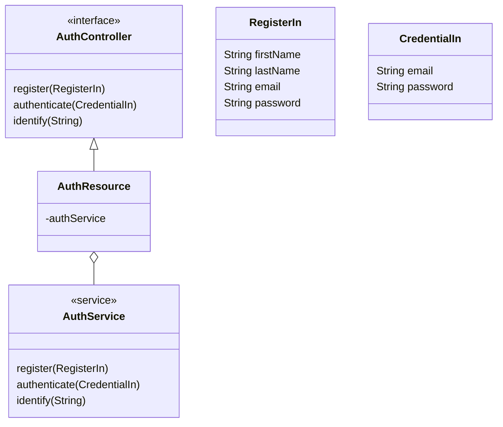

As the platform has only one entrace point, it is

JWT is a decentralized 

The point of entrance of API is the gateway, then as suggested by [^5].

## Auth Service

- Responsabilities:
    - Registration:
    - Authentication:
    - Authorization:

Two Maven Projects

- Interfaces

- Implemmentation: resource

## Addtional Material

- [JSON Web Token](./jwt.md)

- <a href="https://www.youtube.com/watch?v=5w-YCcOjPD0" target="_blank">Fernanda Kipper - Autenticação e Autorização com Spring Security e JWT Tokens</a></i>

    [{ width=80% }](https://www.youtube.com/watch?v=5w-YCcOjPD0){:target="_blank"}

[^5]: DELANTHA, R., [Spring Cloud Gateway security with JWT](https://medium.com/@rajithgama/spring-cloud-gateway-security-with-jwt-23045ba59b8a){:target="_blank"}, 2023.
