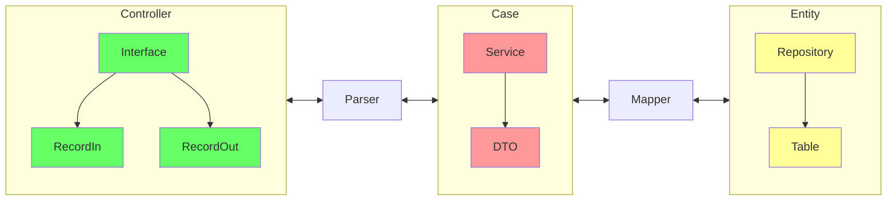

## Clean Architecture

Total desacoplamento das regras de negócios das camadas de interface:

<figure markdown>
  { width="100%" }
  <figcaption><i>Source: <a href="https://blog.cleancoder.com/uncle-bob/2012/08/13/the-clean-architecture.html" target="_blank">The Clean Code Blog</a></i></figcaption>
</figure>

Em nossa arquitetura:

## Referências:

[^1]: :fontawesome-brands-youtube:{ .youtube } [Criando um projeto Spring Boot com Arquitetura Limpa](https://youtu.be/JrT5YV1KMeY){:target="_blank"} by [Giuliana Silva Bezerra](https://github.com/giuliana-bezerra){:target="_blank"}

    [{ width=60% }](https://youtu.be/hit0XHGt4WI){:target="_blank"}

[^2]: :fontawesome-brands-amazon: [Clean Architecture: A Craftsman's Guide to Software Structure and Design](https://www.amazon.com.br/Clean-Architecture-Craftsmans-Software-Structure/dp/B075LRM681/){:target='_blank'}

[^3]: :fontawesome-brands-amazon: [Como se faz DevOps: Organizando pessoas, dos silos aos times de plataforma](https://www.amazon.com.br/Como-faz-DevOps-Organizando-plataforma/dp/B0CSF6NSTQ/){:target='_blank'}