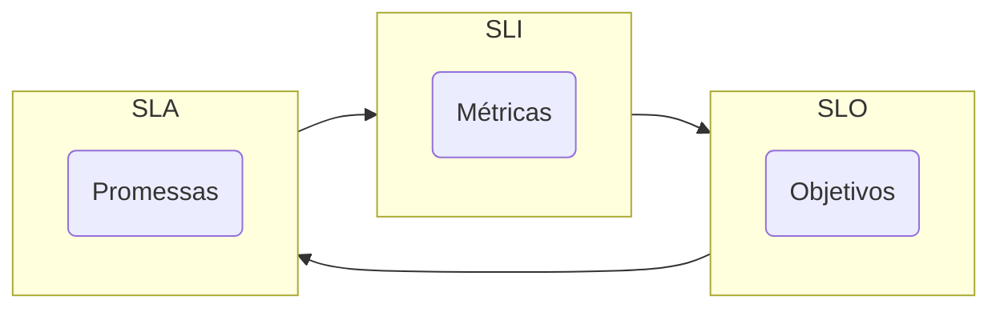

## Compromissos e Contratos

SLI significa Service Level Indicator, ou Indicador de Nível de Serviço. São métricas quantitativas que medem a qualidade de um serviço. Por exemplo, se o SLA especificar que os sistemas vão estar disponíveis 99,95% do tempo, o SLI é a medição real da disponibilidade.

SLO significa Service Level Objective, ou Objetivo de Nível de Serviço. São metas específicas de desempenho que uma equipe de SRE define para cumprir os requisitos do SLA.

SLA significa Service Level Agreement, ou Acordo de Nível de Serviço. É um acordo entre a empresa e o cliente acerca do serviço contratado. Por exemplo, se assinamos com o cliente que vamos manter ativo o seu ecommerce durante pelo menos 99,99% do tempo do mês, isso quer dizer que o máximo de tempo que a página pode estar inacessível durante o mês será 4 minutos e 19 segundos.

## CI/CD - Continuous Integration and Continuous Delivery

CI/CD é uma abordagem prática e ágil para o desenvolvimento de software que combina duas práticas: Integração Contínua (CI) e Entrega Contínua/Implantação Contínua (CD). Esses processos automatizam a construção, teste e implantação de aplicações, facilitando um ciclo de desenvolvimento mais rápido e confiável.

### Conceito de CI/CD

1. **Integração Contínua (CI):**
   - **Objetivo:** Automatizar a integração de código de múltiplos desenvolvedores em um repositório central várias vezes ao dia.
   - **Processo:** Sempre que um desenvolvedor faz commit de código em um repositório, um servidor de CI automaticamente verifica e testa o novo código para detectar problemas rapidamente.
   - **Ferramentas Comuns:** Jenkins, Travis CI, CircleCI, GitLab CI/CD.

2. **Entrega Contínua (CD - Continuous Delivery):**
   - **Objetivo:** Automatizar a entrega de código para um ambiente de produção de maneira segura e rápida.
   - **Processo:** Após a fase de integração contínua, o código é preparado para a produção através de uma série de testes automatizados. O código está sempre pronto para ser implantado com um simples clique ou comando.
   - **Ferramentas Comuns:** Jenkins, GitLab CI/CD, Bamboo.

3. **Implantação Contínua (CD - Continuous Deployment):**
   - **Objetivo:** Automatizar a implantação de código diretamente em produção sem intervenção manual.
   - **Processo:** Após passar por todos os testes, o código é automaticamente implantado em produção. Isso requer um alto nível de confiança nos testes automatizados.
   - **Ferramentas Comuns:** Jenkins, GitLab CI/CD, Spinnaker.

### Vantagens do CI/CD

1. **Detecção Precoce de Problemas:** Integração contínua ajuda a detectar e corrigir problemas rapidamente.
2. **Entrega Rápida:** Automatização da entrega permite que novas funcionalidades e correções cheguem aos usuários mais rapidamente.
3. **Qualidade e Confiabilidade:** Testes automatizados garantem que o código está funcionando conforme esperado antes de ser implantado.
4. **Feedback Rápido:** Desenvolvedores recebem feedback rápido sobre o estado do código, facilitando um desenvolvimento mais ágil e iterativo.
5. **Automação:** Reduz o trabalho manual, minimizando erros humanos e aumentando a eficiência.

### Conclusão

CI/CD é uma prática essencial no desenvolvimento moderno de software, promovendo automação, rapidez e confiabilidade nos processos de integração, teste e implantação de aplicações. Utilizando ferramentas como Jenkins, GitLab CI/CD e outras, equipes de desenvolvimento podem entregar software de alta qualidade de forma contínua e eficiente.

<figure markdown>
  { width="80%" }
  <figcaption><i>Source: <a href="https://pt.wikipedia.org/wiki/DevOps" target="_blank">Wikipedia - Devops</a></i></figcaption>
</figure>

## IaC - Infrastructure as Code

IaC, ou "Infrastructure as Code" (Infraestrutura como Código), é uma abordagem para gerenciar e provisionar a infraestrutura de TI através de arquivos de configuração legíveis por humanos, em vez de processos manuais. Esta prática permite automatizar a configuração de infraestrutura, tornando-a mais eficiente, replicável e gerenciável.

### Conceito de IaC

Em vez de configurar manualmente servidores, redes, e outros componentes de infraestrutura, você escreve código para definir e gerenciar essas configurações. Esse código pode ser armazenado em sistemas de controle de versão, revisado, testado e aplicado de maneira consistente.

### Ferramentas Comuns de IaC

1. **Terraform:** Uma ferramenta de código aberto que permite definir a infraestrutura em um arquivo de configuração usando o HashiCorp Configuration Language (HCL) ou JSON.
2. **AWS CloudFormation:** Um serviço da Amazon Web Services que permite modelar e configurar recursos da AWS.
3. **Ansible:** Uma ferramenta que pode automatizar o provisionamento de infraestrutura, além de gerenciamento de configuração e implantação de aplicações.

### Vantagens do IaC

1. **Consistência:** A infraestrutura é provisionada de forma consistente cada vez que o código é executado.
2. **Reprodutibilidade:** Fácil de replicar ambientes, como desenvolvimento, teste e produção.
3. **Controle de Versão:** As configurações de infraestrutura podem ser versionadas e auditadas, assim como o código de aplicação.
4. **Automação:** Reduz o erro humano e aumenta a velocidade ao automatizar tarefas repetitivas.
5. **Documentação:** O próprio código serve como documentação da infraestrutura.

### Conclusão

IaC transforma a gestão de infraestrutura, permitindo uma abordagem mais ágil, escalável e segura. Usando ferramentas como Terraform, CloudFormation ou Ansible, equipes podem definir, gerenciar e versionar a infraestrutura de maneira eficiente e confiável.

## IaaS - Infrastructure as a Service

IaaS, ou "Infrastructure as a Service" (Infraestrutura como Serviço), é um modelo de serviço de computação em nuvem que oferece recursos computacionais fundamentais como servidores virtuais, armazenamento, e redes, sob demanda, na internet. Esses recursos são escaláveis e gerenciados por um provedor de serviços, permitindo que as empresas evitem o custo e a complexidade de comprar e gerenciar a própria infraestrutura física.

### Conceito de IaaS

Com IaaS, os usuários podem alugar recursos de computação, como máquinas virtuais, armazenamento, e redes, e pagar somente pelo que utilizam. Esse modelo oferece flexibilidade, escalabilidade e eficiência, permitindo que as empresas foquem em suas aplicações e serviços em vez de gerenciar a infraestrutura subjacente.

### Provedores Comuns de IaaS

1. **Amazon Web Services (AWS):** Oferece serviços como EC2 (Elastic Compute Cloud), S3 (Simple Storage Service), e VPC (Virtual Private Cloud).
2. **Microsoft Azure:** Oferece serviços como Azure Virtual Machines, Azure Blob Storage, e Virtual Networks.
3. **Google Cloud Platform (GCP):** Oferece serviços como Compute Engine, Cloud Storage, e Virtual Private Cloud.

### Vantagens do IaaS

1. **Escalabilidade:** Capacidade de aumentar ou diminuir recursos rapidamente conforme a demanda.
2. **Custo-Efetivo:** Pague apenas pelos recursos que utiliza, sem necessidade de grandes investimentos iniciais em hardware.
3. **Flexibilidade:** Escolha e configure recursos conforme suas necessidades específicas.
4. **Redução de Tempo:** Rapidamente provisiona e deprovisiona recursos, acelerando a implementação de novos projetos.
5. **Gerenciamento:** O provedor de IaaS gerencia a infraestrutura física, enquanto você gerencia apenas os recursos alocados.

### Conclusão

IaaS oferece uma solução poderosa e flexível para organizações que precisam de infraestrutura computacional robusta sem o ônus de gerenciar hardware físico. Provedores como AWS, Azure, e GCP facilitam o provisionamento e gerenciamento de servidores, armazenamento e redes, permitindo que as empresas se concentrem no desenvolvimento e operação de suas aplicações e serviços.

## PaaS - Platform as a Service

PaaS, ou "Platform as a Service" (Plataforma como Serviço), é um modelo de serviço de computação em nuvem que fornece uma plataforma permitindo que os clientes desenvolvam, executem e gerenciem aplicações sem a complexidade de construir e manter a infraestrutura normalmente associada ao desenvolvimento e ao lançamento de uma aplicação.

### Exemplo de PaaS
Imagine que você é um desenvolvedor de software e deseja criar um aplicativo web.

!!! warning "Sem PaaS"

    - Configuração do Servidor: Você precisaria comprar servidores físicos ou máquinas virtuais para hospedar sua aplicação.
    - Instalação do Sistema Operacional: Configurar o sistema operacional nos servidores.
    - Configuração de Redes e Segurança: Configurar redes, firewalls, e garantir a segurança da aplicação.
    - Banco de Dados: Instalar e gerenciar o banco de dados.
    - Manutenção: Monitorar e manter o sistema, aplicando patches de segurança e atualizações.

!!! success "Com PaaS"

    - Escolha da Plataforma: Você escolhe uma plataforma PaaS, como Google App Engine, Microsoft Azure, ou Heroku.
    - Desenvolvimento da Aplicação: Foca apenas no desenvolvimento do código da aplicação.
    - Desdobramento: Sobe (deploy) o código para a plataforma PaaS.
    - Gestão e Escalabilidade: A plataforma cuida automaticamente da hospedagem, segurança, balanceamento de carga, escalabilidade, e manutenção.

### Vantagens do PaaS

- Redução de Complexidade: Você não precisa se preocupar com a infraestrutura subjacente.
- Escalabilidade: Fácil de escalar sua aplicação conforme a demanda.
- Foco no Desenvolvimento: Permite focar mais no desenvolvimento da aplicação e menos na gestão de servidores.
- Custo-Efetivo: Geralmente paga-se apenas pelos recursos usados, evitando grandes investimentos iniciais em hardware.

### Conclusão

Em resumo, PaaS permite que desenvolvedores se concentrem em criar e melhorar suas aplicações sem se preocupar com a infraestrutura necessária para suportá-las.

## PaaP - Platform as a Product

"PaaP" significa "Plataforma como Produto", um conceito que vê uma plataforma não apenas como um conjunto de ferramentas ou serviços, mas como um produto completo e coeso que fornece uma solução abrangente para seus usuários. É diferente de Plataforma como Serviço (PaaS), que geralmente foca em fornecer a infraestrutura e o ambiente para desenvolver, executar e gerenciar aplicações. PaaP enfatiza a experiência do usuário, a integração e o valor entregue ao usuário como um produto unificado.

### Conceitos-Chave do PaaP

1. **Solução de Ponta a Ponta:** PaaP fornece uma solução completa que cobre todos os aspectos das necessidades do usuário, desde o desenvolvimento e implantação até o gerenciamento e escalabilidade. Ele integra várias ferramentas e serviços em uma experiência contínua.

2. **Design Centrado no Usuário:** A plataforma é projetada com foco na experiência do usuário. Prioriza a facilidade de uso, interfaces intuitivas e fluxos de trabalho simplificados para garantir que os usuários possam atingir seus objetivos de forma eficiente.

3. **Integração e Interoperabilidade:** Plataformas PaaP frequentemente integram múltiplos serviços e ferramentas, garantindo que eles funcionem juntos de forma harmoniosa. Essa integração reduz a complexidade para os usuários, que não precisam gerenciar sistemas diferentes.

4. **Entrega de Valor:** A plataforma é empacotada e comercializada como um produto que entrega proposições de valor específicas aos seus usuários. É projetada para resolver problemas específicos ou atender necessidades específicas de maneira abrangente.

5. **Melhoria Contínua:** Produtos PaaP são continuamente melhorados com base no feedback dos usuários e nas demandas do mercado. Atualizações e aprimoramentos regulares garantem que a plataforma permaneça relevante e eficaz.

### Exemplo: Salesforce

O Salesforce é um exemplo notável de Plataforma como Produto. Ele oferece uma suíte abrangente de ferramentas para gerenciamento de relacionamento com clientes (CRM), mas vai além de apenas fornecer infraestrutura.

1. **Solução de CRM de Ponta a Ponta:** O Salesforce fornece ferramentas para vendas, atendimento ao cliente, automação de marketing, análises e mais, tudo integrado em uma única plataforma.

2. **Design Centrado no Usuário:** O Salesforce é projetado para ser fácil de usar, com painéis personalizáveis, interfaces intuitivas e amplos recursos de suporte.

3. **Integração e Interoperabilidade:** Ele integra com uma ampla gama de aplicações e serviços de terceiros, permitindo que os usuários conectem seu CRM com outras ferramentas que utilizam em seus negócios.

4. **Entrega de Valor:** O Salesforce é comercializado como um produto que ajuda as empresas a gerenciar seus relacionamentos com clientes de forma mais eficaz, melhorar as vendas e aprimorar o atendimento ao cliente.

5. **Melhoria Contínua:** O Salesforce lança regularmente atualizações e novos recursos com base no feedback dos usuários e nos avanços tecnológicos, garantindo que a plataforma evolua com as necessidades dos usuários.

### Benefícios do PaaP

1. **Experiência do Usuário Simplificada:** os usuários interagem com uma única plataforma unificada, simplificando seu fluxo de trabalho e reduzindo a necessidade de gerenciar múltiplas ferramentas.

2. **Aumento da Produtividade:** ferramentas e serviços integrados simplificam os processos, levando a uma maior eficiência e produtividade.

3. **Escalabilidade:** soluções PaaP são projetadas para escalar com as necessidades do usuário, facilitando o crescimento sem a necessidade de trocar de plataformas ou ferramentas.

4. **Maior Valor:** ao fornecer uma solução abrangente, PaaP entrega maior valor aos usuários, atendendo suas necessidades de forma mais eficaz do que ferramentas dispersas.

5. **Adaptação Contínua:** atualizações e melhorias regulares garantem que a plataforma permaneça relevante e útil à medida que as necessidades dos usuários evoluem.

### Conclusão

Plataforma como Produto (PaaP) representa uma abordagem holística para a entrega de soluções tecnológicas, focando em fornecer produtos completos, integrados e centrados no usuário. Ao combinar as forças de várias ferramentas e serviços em uma plataforma coesa, PaaP oferece maior valor, simplicidade e eficiência aos seus usuários. Salesforce é um exemplo notável, mas os princípios de PaaP podem ser aplicados em diversas indústrias e soluções tecnológicas para criar plataformas mais eficazes e amigáveis.

[^1]: :fontawesome-brands-amazon: [Platform Revolution: How Networked Markets Are Transforming the Economy and How to Make Them Work for You](https://www.amazon.com.br/Platform-Revolution-Networked-Markets-Transforming/dp/0393354350/){:target='_blank'}