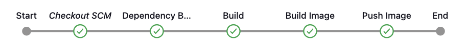
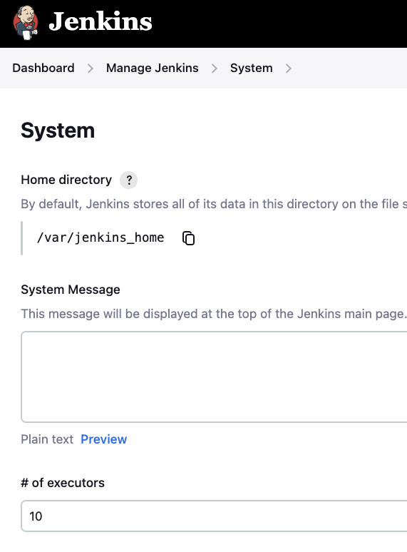

=== "Docker Compose"

    ``` yaml title="docker-compose.yaml"
    # docker compose up -d --build --force-recreate
    version: '3.8'
    name: infra

    services:

    jenkins:
        container_name: jenkins
        build:
        dockerfile_inline: |
            FROM jenkins/jenkins:jdk21
            USER root
            RUN apt-get update && apt-get install -y lsb-release
            RUN curl -fsSLo /usr/share/keyrings/docker-archive-keyring.asc \
            https://download.docker.com/linux/debian/gpg
            RUN echo "deb [arch=$(dpkg --print-architecture) \
            signed-by=/usr/share/keyrings/docker-archive-keyring.asc] \
            https://download.docker.com/linux/debian \
            $(lsb_release -cs) stable" > /etc/apt/sources.list.d/docker.list
            RUN apt-get update && apt-get install -y docker-ce maven
            RUN usermod -aG docker jenkins
        # RUN usermod -aG daemon jenkins
        # RUN usermod -aG root jenkins
        # USER jenkins
        # RUN jenkins-plugin-cli --plugins "blueocean docker-workflow"
        ports:
            - 9080:8080
            - 50000:50000 
        volumes:
            - $CONFIG/jenkins:/var/jenkins_home
            # for mac distro
            - /var/run/docker.sock:/var/run/docker.sock
        restart: always
        networks:
            - infra

    networks:
        infra:
            driver: bridge
    ```

=== "Environment Variables"

    ``` properties title=".env"
    CONFIG=./config
    ```

To run this container:

``` shell
docker compose up -d --build
```

The will be avaliable at:
``` shell
http://localhost:9000
```

### Pipeline


#### Checkout SCM

``` groovy  title="Jenkinsfile"
pipeline {
    agent any

    stages {
        stage('Build') {
            steps {
                sh 'mvn -B -DskipTests clean install'
            }
        }
    }
}
```


Definindo o número máximo de executores.



Instalando o plugin para executar o Docker dentro do Jenkins container.


BASED ARTICLE:

[Getting “Permission Denied” error when pulling a docker image in Jenkins docker container on Mac](https://medium.com/swlh/getting-permission-denied-error-when-pulling-a-docker-image-in-jenkins-docker-container-on-mac-b335af02ebca){target='_blank'}