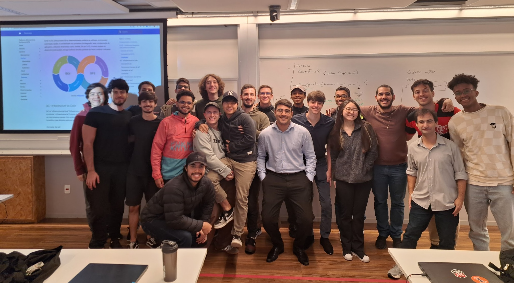

{ .rounded-corners }

???+ info

    :fontawesome-regular-address-book: Prof. [Humberto Sandmann](https://hsandmann.github.io){target='_blank'}

    :fontawesome-regular-envelope: [humbertors@insper.edu.br](mailto:humbertors@insper.edu.br){target='_blank'}

!!! example "Students"

    <iframe src="https://docs.google.com/spreadsheets/d/e/2PACX-1vRxWZJ4eS1ss6EM_PPd54TVpaLwrAllQ6fG8jCMYN5k75ULinkfWcNoNaA_ChgFxgllXeoaalOq9a6C/pubhtml?gid=0&amp;single=true&amp;widget=false&amp;headers=false" width="100%" height="650px"></iframe>

!!! abstract "Meetings"

    | Evento | Dia | Início | Término |
    |-|:-:|-:|-:|
    | Aula | Qua. | 09h45 | 11h45 |
    | Aula | Sex. | 07h30 | 09h30 |
    | Atendimento | Seg. | 12h00 | 13h30 |

!!! success "Grades"

    === "Final"

        $$
        \text{Final Grade} = \left\{\begin{array}{lll}
            \text{Individual} \geq 5 \bigwedge \text{Team} \geq 5 &
            \implies &
            \displaystyle \frac{ \text{Individual} + \text{Team} } {2}
            \\
            \\
            \text{Otherwise} &
            \implies &
            \min\left(\text{Individual}, \text{Team}\right)
            \end{array}\right.
        $$

    === "Individual"
        | Avaliação | | Descrição | Data | Nota (%) |
        |-|-|-|:-:|-:|
        | Roteiros |  | Média aritmética dos 2 roteiros de maiores notas. | | 60.0 |
        |  | Roteiro 1 | Testes | - | |
        |  | Roteiro 2 | Bottlenecks | 22.mai | |
        |  | Roteiro 3 | Cloud | 22.mai | |
        | Participação | | Nota geral atribuída ao grupo distribuída aos membros pelo próprio grupo, apenas notas inteiras $[0; 10]$ | | 40.0 |

    === "Team"
        | Avaliação | | Descrição | Data | Nota (%) |
        |-|-|-|:-:|-:|
        | Checkpoints | | | | |
        | | CP1 | Montar um Spring Cloud | 05.abr | 7.5 |
        | | CP2 | Testes e Pipeline | 19.abr | 7.5 |
        | | CP3 | K8s | 10.mai | 7.5 |
        | | CP4 | Platform as a Product | 22.mai | 7.5 |
        | Apresentação | | | | 10.0 |
        | Projeto | | | | 60.0 |

!!! Individual

    === "Roteiro 1"

        Testes

        - [x] Roteiros de testes de funcionalidades ou de testes de carga
        - [x] Documentação dos resultados obtidos

    === "Roteiro 2"

        Bottlenecks

        - [x] Implementação de um microserviço de *bottleneck* para o projeto:

            - Mensageria
                * [RabbitMQ](https://spring.io/guides/gs/messaging-rabbitmq){target='_blank'}
                * [Kafka](https://www.baeldung.com/spring-kafka){target='_blank'}
                * [Spring e Kafka, Giuliana Bezerra](https://youtu.be/97TF2xZgAhU){target='_blank'}
            - Resiliência
                * [Spring Cloud Circuit Breaker](https://spring.io/guides/gs/cloud-circuit-breaker){target='_blank'}
            - Configuração
                * [Spring Cloud Config](https://docs.spring.io/spring-cloud-config/docs/current/reference/html/){target='_blank'}
            - In-Memory Database
                * [Redis, Giuliana Bezerra](https://youtu.be/YcI9b-lgi7w){target='_blank'}
            - Payments (sandboxes)
                * [PayPal](https://developer.paypal.com/tools/sandbox/){target='_blank'}
                * [Hearland](https://developer.heartlandpaymentsystems.com/){target='_blank'}
                * [Mercado Pago](https://www.mercadopago.com.br/developers/pt){target='_blank'}
            - Jenkins
                * [SonarQube](https://docs.sonarsource.com/sonarqube/latest/analyzing-source-code/ci-integration/jenkins-integration/key-features/){target='_blank'}
                * [Dependency Analyzes](){target='_blank'}

    === "Roteiro 3"

        Cloud

        - [x] Roteiro de publicação de um microsserviço em Cloud

    === "Participação"

        - [x] Contribuições no GitHub dos participantes
        - [x] Documentação das reuniões (dayly, retro, etc)
        - [x] Nota geral atribuída pelo professor mas dividida pelo grupo

!!! Team

    === "Checkpoint 1"

        Desenvolvimento Spring Cloud

        - [x] Serviço de discovery
        - [x] Serviço de gateway
        - [x] Serviço de autenticação e autorização
        - [x] 3 microsserviços com persistência de dados
        - [x] Comunicação entre, ao menos 2, microsserviços, além de: Gateway $\rightarrow$ Auth $\rightarrow$ Account
        - [x] Monitoramento com dashboard de microsserviços
        - [x] Documentação das APIs padrão Swagger
        - [x] Cluster em Docker Compose para deploy dos microsserviços

    === "Checkpoint 2"

        Testes e Pipeline

        - [x] Plano de testes
        - [x] Script Jenkins - [Pipeline as Code](https://www.jenkins.io/doc/book/pipeline/pipeline-as-code/){target="_blank"}

    === "Checkpoint 3"

        K8s

        - [x] Release no [Minikube](https://kubernetes.io/pt-br/docs/tutorials/hello-minikube/){target="_blank"}
        - [x] Scripts declarativos dos serviços

    === "Checkpoint 4"

        Platform as a Service

        - [x] Plano de uso da plataforma como um produto (PaaS)
        - [x] Vislumbrar uso da plataforma por terceiros

    === "Apresentação"

        - [x] Storytelling (começo, meio, fim)
        - [x] Fluídez
        - [x] Qualidade do material apresentado
        - [x] Tempo
        - [x] Participação

    === "Projeto"

        - [x] Checkpoint 1
        - [x] Checkpoint 2
        - [x] Checkpoint 3
        - [x] Checkpoint 4
        - [x] Planejamento
        - [x] Documentação (markdown)
        - [x] Frontend (funcionalidades básicas: login, registro, dashboard, etc)

!!! Planning

    <iframe src="https://docs.google.com/spreadsheets/d/e/2PACX-1vSIYIKGE8jucmefQP0HKs1MDLzHPyRgcdOZce9BU-hiNiuiOUyzMHg5Sa32GZO_PxotaxBDC-8dHhKm/pubhtml?widget=true&amp;headers=false" width="100%" height="600px"></iframe>

## Repositories

!!! Dev

    | Microservice | Context | Interface | Service |
    |-|-|-|-|
    | Discovery | Infra |  | [platform.241.store.discovery](https://github.com/hsandmann/platform.241.store.discovery){target="_blank"} | 
    | Gateway | Infra | | [platform.241.store.gateway](https://github.com/hsandmann/platform.241.store.gateway){target="_blank"} |
    | Postgres | Database | | [platform.241.store.db](https://github.com/hsandmann/platform.241.store.db){target='_blank'} |
    | Account | Business | [platform.241.store.account](https://github.com/hsandmann/platform.241.store.account){target="_blank"} | [platform.241.store.account-resource](https://github.com/hsandmann/platform.241.store.account-resource){target="_blank"} |
    | Auth | Business | [platform.241.store.auth](https://github.com/hsandmann/platform.241.store.auth){target="_blank"} | [platform.241.store.auth-resource](https://github.com/hsandmann/platform.241.store.auth-resource){target="_blank"} |

!!! Ops

    | Description | Repositories | Commands |
    |--|--|--|
    | Docker Compose API | [platform.241.store.docker-api](https://github.com/hsandmann/platform.241.store.docker-api){target="_blank"} | `docker compose up --build`{.shell}   `docker compose down`{.shell} |
    | Jenkins Pipelines | [platform.241.store.ops](https://github.com/hsandmann/platform.241.store.ops) |  `docker compose up --build`{.shell}   `docker compose down`{.shell}   [http://localhost:9000](http://localhost:9000){target='_blank'} |

